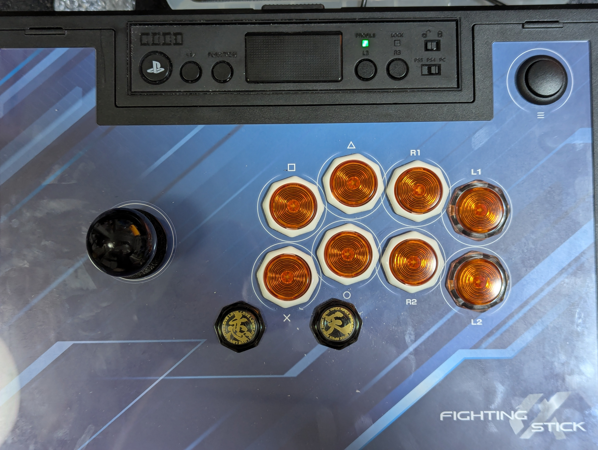

My arcade stick is a HORI Fighting Stick Alpha base with almost everything inside
swapped out. Every button is now a GamerFinger switch, the lever is a silenced JLF
with a red spring and octagonal gate to firm it up, and I drilled an extra 20mm hole
under the weak kick button. I built it around October 2025.

I honestly assumed the total cost was pretty modest. This time I actually dug through
my Amazon and bank order history and reconstructed the real total from receipts.
It was higher than I expected.

## Base unit and parts

| Item | Cost | Purchased |
|---|---|---|
| Base unit (used, Yahoo Auctions) | ¥13,000 | unknown |
| GamerFinger 30mm ×6 | ¥5,040 | 2021-09 |
| GamerFinger 30mm ×2 (extra) | ¥1,460 | unknown (estimated at 2021 unit price) |
| GamerFinger 24mm ×2 (black, custom art) | ¥2,245 | unknown |
| Silenced lever (JLF-TP-8YT-SK-AG) | ¥3,191 | 2018-10 |
| Red spring (JLF-SP 2-2) | ¥968 | 2025-01 |
| Octagonal gate (GTX-) | ¥1,199 | 2025-09 |
| Step drill bit | ¥849 | 2025-10 |
| Drill rental (3 days) | approx. ¥1,000 | unknown |
| **Total** | **¥28,952** | |

The used base unit (¥13,000) and the buttons piling up quietly (¥8,745 combined)
did more damage to the total than I expected. The lever itself was bought years
earlier, in 2018, and only got repurposed into this build later.

## The biggest surprise while digging through receipts

I genuinely doubted the ¥3,191 figure for the lever at first — it didn't feel real.
Digging through Amazon order history turned up the actual October 2018 order, and
the amount matched exactly. While I was at it, I also confirmed something I hadn't
verified before: the "SK" in the model number `JLF-TP-8YT-SK` is Sanwa Denshi's
official designation for the silenced variant, even though the product listing
title itself never uses the word "silent."

## How the wiring actually works

I'm not confident with a soldering iron, so not every button — including the extra
20mm one — is wired up at the same time. I move the harness cable that originally
went to the two outermost buttons over to whichever ones I actually want active:
the outer 24mm button (assigned to Parry) and L1 (assigned to Drive Impact). The
other extra button I added sits too close to the others to reach comfortably, so
it stays unwired.
